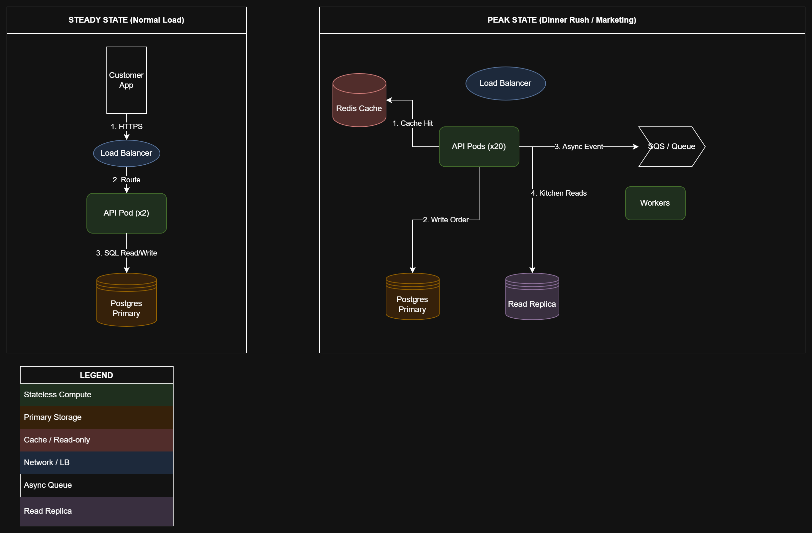

# CityBite — System Design Summary

This document summarizes the key concepts, patterns, and decisions from our system‑design walkthrough of CityBite, a food‑delivery platform built for high traffic and peak‑hour reliability.

---

## 1. Data Plane Overview

### 1.1 Write Path (New Orders)
* Orders are written directly to the Postgres Primary for strong consistency.
* After the write, an event is pushed to a queue (SQS/RabbitMQ).
* **Strong consistency** for payments & order status.
* **Eventual consistency** for notifications & analytics.

### 1.2 Read Path (Kitchen Active Orders)
* Kitchens query orders using indexes on `restaurant_id` + `status`.
* Reads go to a **Read Replica** to avoid slowing down checkout.

### 1.3 Caching (Restaurant Menus)
* Menus cached in Redis using `menu:v1:{restaurant_id}`.
* **TTL = 30 minutes**, with explicit invalidation on menu updates.
* Stale reads are acceptable during peak load.

### 1.4 Queueing (Async Work)
* API returns **202 Accepted** after saving the order.
* Background workers handle SMS, push notifications, and printer jobs.

---

## 2. Scaling & Performance

### 2.1 Autoscaling (HPA)
* Scale Order API pods when **CPU > 60%** or **RPS > 400**.
* **Min pods:** 3
* **Max pods:** 40
* Each pod handles ~500 concurrent requests.

### 2.2 Backpressure
* Stop non‑critical jobs if queues exceed 10,000 messages.
* Return **503 + Retry-After** when DB connections are full.
* Disable heavy features (like ML ETA) during extreme load.

### 2.3 Scaling Limits
* Stateless API pods scale easily.
* The database does not — too many pods can exhaust DB connections.
* **Fixes:** Vertical DB scaling or PgBouncer.

---

## 3. Architecture Patterns

### 3.1 Load Balancing
* Layer 7 load balancer spreads traffic across stateless API pods.
* Automatically avoids unhealthy pods.

### 3.2 Sharding (Future)
* Not needed in Year 1, but system is shard‑ready.
* Likely shard by `region_id` or `city_id`.

### 3.3 Scatter/Gather
* Used for global search (e.g., “best tacos”).
* Query multiple regions in parallel and merge results.

### 3.4 Master/Worker
* API handles fast tasks.
* Workers handle slow tasks (PDFs, notifications, dispatch logic).

### 3.5 Multi‑Tenant Fairness
* Rate limits and quotas prevent one restaurant from hogging resources.

---

## 4. Operational Limits
* The **Postgres Primary** is the main bottleneck.
* It cannot scale infinitely — write throughput and max connections are hard limits.
* Long‑term scaling requires sharding or functional partitioning.

---

## 5. System Architecture Diagram

Below is the visualization of the CityBite architecture comparing Steady State (normal operations) against Peak State (dinner rush).

---

## 6. Files Included in this Assignment

| File Name | Description |
| :--- | :--- |
| `part1_workload_and_bottlenecks.md` | Analysis of growth dimensions and the "Hero Scenario." |
| `part1_scale_decisions.md` | Decision log for scaling up vs. scaling out subsystems. |
| `part2_data_scaling.md` | Deep dive into the read/write paths and caching strategy. |
| `part2_architecture_steady_vs_peak.drawio` | Editable XML source for the system diagram. |
| `part2_architecture_steady_vs_peak.png` | Exported image of the architecture diagram. |
| `part3_patterns.md` | Checklist of applied architectural patterns (LB, Sharding, etc.). |
| `part3_autoscaling_and_limits.md` | HPA rules, backpressure policies, and DB failure lessons. |