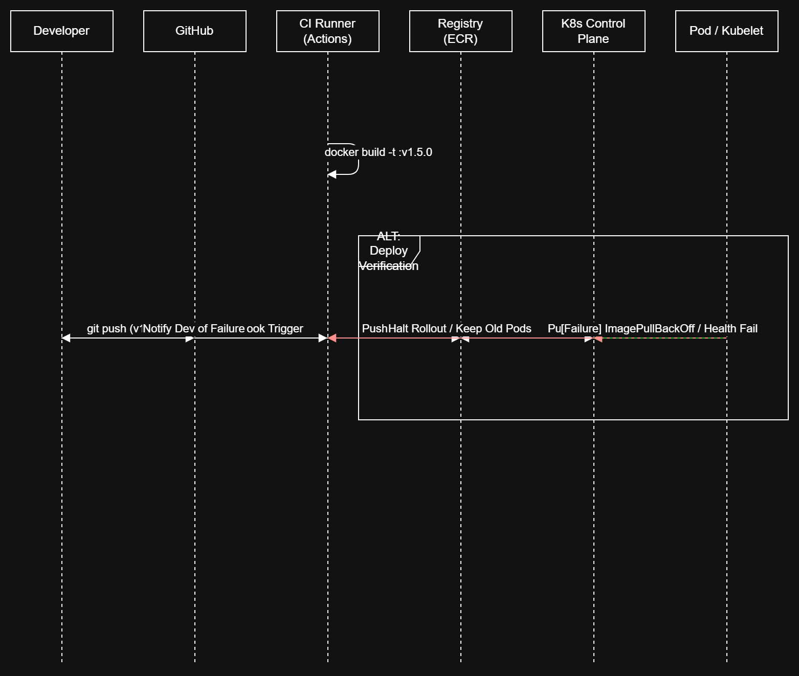

# Assignment Submission: Lecture 9

**Student Name**: Sonia Managane  
**Submission Date**: 13 April 2026

## CityBite Infrastructure Migration: From Pets to Kubernetes

## Project Overview
This project documents the architectural shift of **CityBite** (our food delivery platform) from a legacy "pets-on-VMs" model to a modern, containerized orchestration on **AWS EKS**. 

The goal was to solve recurring production pain points—like manual deployment errors, "snowflake" servers, and downtime during traffic spikes—by implementing principles of **Deployability, Portability, and Containerization**.

---

## 1. The Problem: Legacy "Pet" Infrastructure
Before this migration, our infrastructure was fragile:
* **Manual Deployments:** We used SSH scripts to update servers. If a script failed halfway, the server was left in a "broken" state.
* **Host Drift:** No two VMs were exactly alike, making it hard to debug "it works on my machine" issues.
* **Storage Bottlenecks:** Menu images were saved to the local VM disk. If the VM died, we lost data.
* **Scaling:** Handling dinner spikes required manual VM scaling, which took minutes—too slow for hungry customers.

---

## 2. The Solution: Target Architecture
We moved the CityBite Monolith into **Docker containers** managed by **Amazon EKS**. 

### Architecture Comparison (Before vs. After)
The diagram below illustrates how we decoupled the application from the hardware. We moved from a single VM to a cluster where the API and Workers run as independent "Pods."

**Key Changes:**
* **Ingress (ALB):** Handles incoming traffic and routes it to the cluster.
* **Stateless API:** The API no longer saves files to its own disk.
* **Amazon S3:** We replaced local storage with S3 for menu JPEGs to ensure data is persistent and portable.
* **Managed RDS:** Postgres stays outside the cluster for better reliability.

---

## 3. Containerization & The "Contract"
To make the app run anywhere (Dev, CI, Prod), we defined a strict **Runtime Contract**:
1. **Immutable Images:** We use `python:3.11-slim` to keep images small and secure.
2. **Environment Variables:** The app gets its config (like `DATABASE_URL` and `PORT`) from the environment, not from hardcoded files.
3. **Health Probes:** We implemented **Liveness** and **Readiness** probes. Kubernetes now knows if the app is "frozen" or "unhealthy" and can restart it automatically.

---

## 4. Automated Delivery (CI/CD)
We automated the path from code to production. No more manual SSH.

### Delivery Sequence Diagram
This flow ensures that every change is tested, packaged into an image, and deployed without downtime using **Rolling Updates**.

**Failure Handling:** If a new version (e.g., `v1.5.0`) fails its health checks, Kubernetes automatically stops the rollout. This prevents a "bad push" from taking down the entire site.

---

## 5. Files Included

| File | Description |
| :--- | :--- |
| **`part1_deployability_assessment.md`** | Analysis of legacy risks and the technical mitigations enabled by Kubernetes. |
| **`part1_architecture_before_after.png`** | Diagram comparing the legacy VM monolith to the target EKS state. |
| **`part2_container_spec.md`** | Details on the Dockerfile choice, process model, and environment variables. |
| **`part2_health_and_rollout.md`** | Documentation on health probes and our zero-downtime rollout strategy. |
| **`part3_portability_and_state.md`** | Strategy for managing persistent data (S3) and maintaining dev/prod parity. |
| **`part3_delivery_sequence.png`** | Sequence diagram showing the flow from code commit to running pods. |
| **`README.md`** | Project executive summary (this file). |

---

## 6. Summary of Files in this Repo
* `part1_deployability_assessment.md`: Detailed analysis of legacy risks and K8s mitigations.
* `part2_container_spec.md`: The Dockerfile blueprint and runtime environment variables.
* `part2_health_and_rollout.md`: How we handle rolling updates and self-healing.
* `part3_portability_and_state.md`: Our strategy for managing secrets and S3 cloud storage.
* `*.drawio / *.png`: Full-resolution architecture and sequence diagrams.

